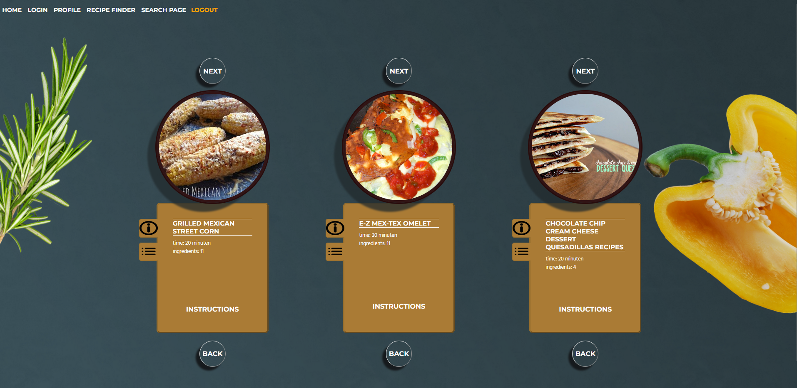

# What to eat tonight? the application (temp name)


## Table of Contents
- [Description](#description)
- [Installation](#installation)
- [Configuration](#configuration)
- [Usage](#usage)
- [Dependencies](#dependencies)
- [Contributing](#contributing)

## Github link

https://github.com/JJ-Bas/eindopracht-novi-recepten-app

## Description 

This project is a website built using React. It utilizes the Edamam API to help users to find a recipe fitting to their
needs.
Users can browse and search the Edamam API recipe database or they have to option to use the recipefinder function to
providem with a fitting selection of recipes to help them choose!

## Installation

To run the website locally, please follow these steps:

1. Clone the repository to your local machine:

   ```bash
   git clone <repository_url>
   ```

2. Navigate to the project directory:

   ```bash
   cd <project_directory>
   ```

3. Install the required dependencies using npm:

   ```bash
   npm install
   ```

## Configuration {#configuration}

To configure the project, you need to obtain an API key and ID from Edamam. Here's how you can do it:

1. Sign up at [https://www.edamam.com/](https://www.edamam.com/) to create an account.

2. After signing up and logging in, navigate to your account settings or developer dashboard to obtain your API key and
   ID.

3. Create an `.env` file in the `src` directory of the project.

4. In the `.env` file, add the following lines:

   ```bash
   REACT_APP_API_KEY=<your_api_key>
   REACT_APP_API_ID=<your_api_id>
   ```

   Replace `<your_api_key>` and `<your_api_id>` with the corresponding values you obtained from Edamam.

## Usage

Once you have installed the dependencies and configured the API key and ID, you can run the project locally using the
following command:

```bash
npm start
```

This command starts the development server and launches the website in your default browser. You can access it by
navigating to [http://localhost:3000](http://localhost:3000).

## Dependencies

This project relies on the following dependencies:

- [Edamam Recipe Search API](https://developer.edamam.com/edamam-recipe-api): This project uses the free developer
  version of the Edamam Recipe Search API for retrieving recipe data. Please refer to the provided link for more
  information on the API and its usage.

- JavaScript React: The project is built using React, a JavaScript library for building user interfaces. You can find
  the documentation for React [here](https://react.dev/).

- NOVI Educational Backend: This project utilizes the NOVI Educational Backend for certain functionalities. The backend
  is hosted on Heroku, a cloud platform. For more information on Heroku,
  visit [https://www.heroku.com/](https://www.heroku.com/). You can find the documentation for the NOVI Educational
  Backend [here](https://github.com/hogeschoolnovi/novi-educational-backend-documentation). Imported things to know
  about this educational server is that it becomes inactive after not being used for a while. This application sends a
  wake-up request to the server when mounting the application. The database of this server is deleted every hour so the
  account created to login is only temporary.

Please ensure that these dependencies are properly set up and accessible in order to run the project successfully.

## Contributing

If you would like to contribute to this project, you can follow these steps:

1. Fork the repository on GitHub.

2. Clone your forked repository to your local machine.

3. Create a new branch for your feature or bug fix:

   ```bash
   git checkout -b feature/your-feature-name
   ```

4. Make your changes and commit them with descriptive commit messages.

5. Push your changes to your forked repository:

   ```bash
   git push origin feature/your-feature-name
   ```

6. Create a pull request on the original repository to merge your changes.
